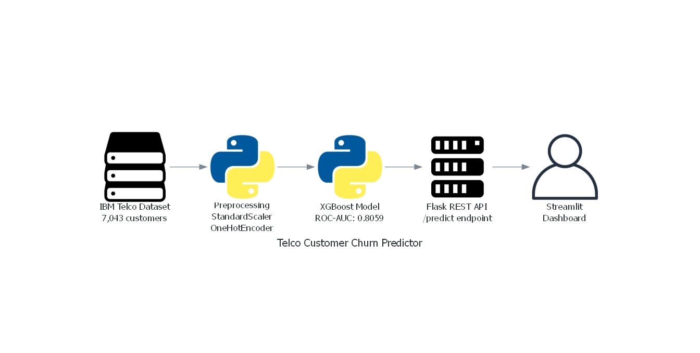
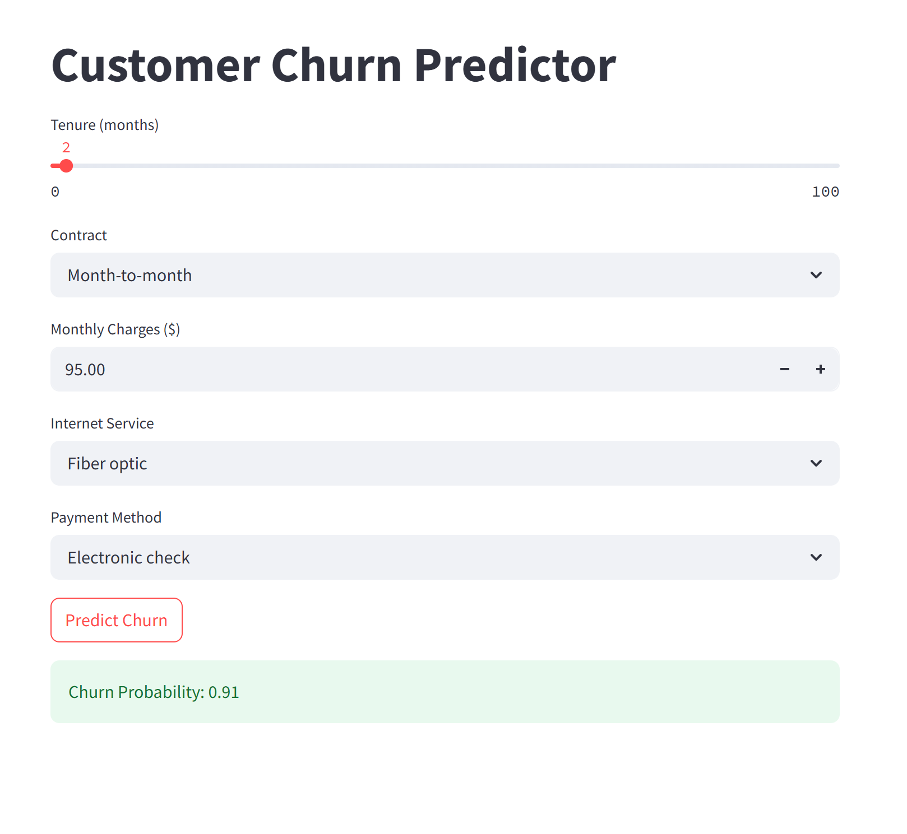
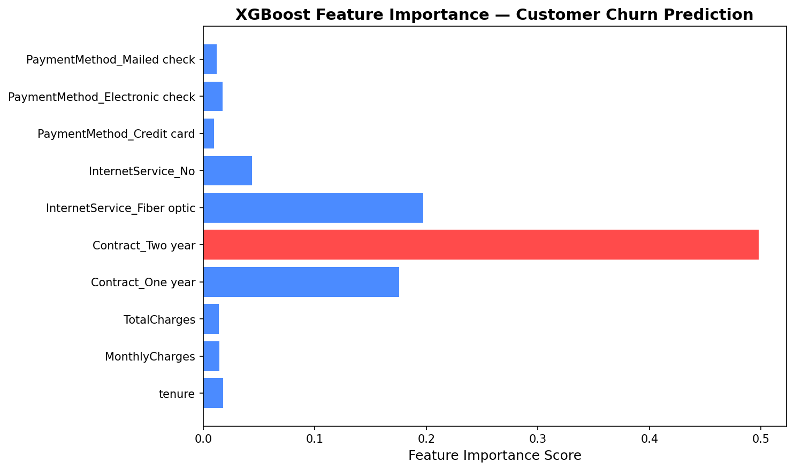
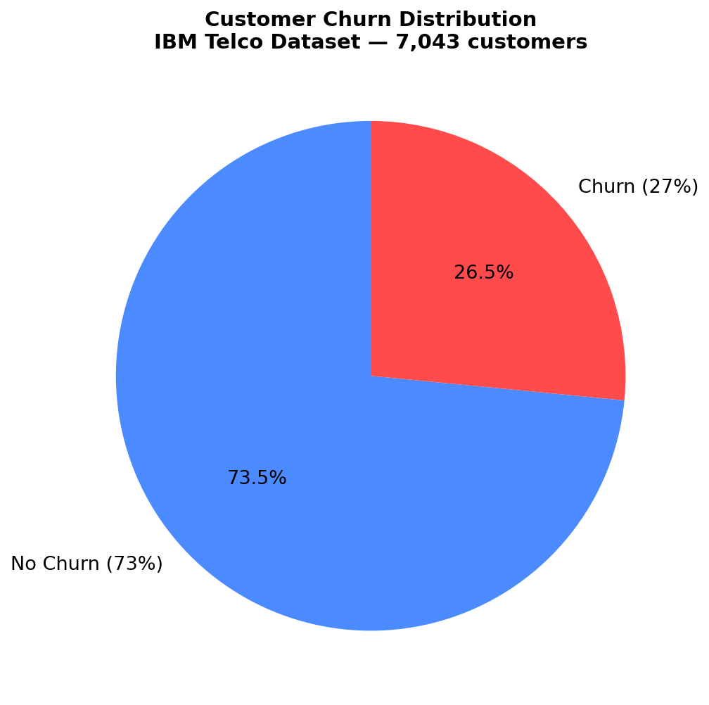

# 📉 Telco Customer Churn Predictor

[](https://python.org)
[](https://xgboost.readthedocs.io)
[](https://flask.palletsprojects.com)
[](https://streamlit.io)
[](https://scikit-learn.org)

> An end-to-end ML pipeline predicting which telecom customers are likely to churn — served via a Flask REST API and an interactive Streamlit dashboard.

---

## 🏗️ Architecture



---

## 🎯 Live Demo — Streamlit Dashboard



*New customer, month-to-month contract, $95/month fiber optic bill → **91% churn probability***

---

## 📊 Model Results

| Metric | Score |
|--------|-------|
| ROC-AUC | **0.8059** |
| Accuracy | 74% |
| Churn Recall | 68% |
| Dataset | 7,043 Telco customers |
| Model | XGBoost (class imbalance handled) |

---

## 📈 Feature Importance



---

## 🍩 Churn Distribution



---

## 🔍 Key Business Insights

| Finding | Detail |
|---------|--------|
| Highest churn risk | Month-to-month + Fiber optic + Electronic check |
| Lowest churn risk | Two-year contract + long tenure |
| Most important feature | Tenure — longer customers stay = lower churn |
| Class imbalance | 27% churn vs 73% no-churn — handled via scale_pos_weight |

---

## 🚀 API Usage

Start the Flask API:
```bash
python app.py
```

Send a prediction request:
```bash
curl -X POST http://localhost:5000/predict \
  -H "Content-Type: application/json" \
  -d '{
    "tenure": 2,
    "Contract": "Month-to-month",
    "MonthlyCharges": 95.0,
    "TotalCharges": 190.0,
    "InternetService": "Fiber optic",
    "PaymentMethod": "Electronic check",
    "gender": "Female",
    "SeniorCitizen": 0,
    "Partner": "Yes"
  }'
```

Response:
```json
{"churn_probability": 0.91}
```

---

## 🗂️ Project Structure
```
customer-churn-project/
├── app.py                    # Flask REST API
├── dashboard.py              # Streamlit interactive dashboard
├── src/
│   ├── preprocess.py         # Feature engineering + preprocessing pipeline
│   └── train_model.py        # XGBoost model training
├── models/
│   ├── churn_model.pkl       # Trained XGBoost model
│   └── preprocessor.pkl      # Fitted sklearn preprocessor
├── data/
│   └── WA_Fn-UseC_-Telco-Customer-Churn.csv
├── images/
│   ├── architecture.png
│   ├── dashboard.png
│   ├── feature_importance.png
│   └── churn_distribution.png
└── requirements.txt
```

---

## ⚙️ Tech Stack

| Layer | Tool |
|-------|------|
| ML Model | XGBoost |
| Preprocessing | Scikit-learn (StandardScaler, OneHotEncoder) |
| REST API | Flask |
| Dashboard | Streamlit |
| Language | Python 3.11 |

---

## 🏃 Run Locally
```bash
git clone https://github.com/navinnagisetty/customer-churn-project.git
cd customer-churn-project
pip install -r requirements.txt

# Run API
python app.py

# Run Dashboard
streamlit run dashboard.py
```

---

## 👤 Author

**Navin Kumar Nagisetty**
📧 navinnagisetty@gmail.com
💼 [LinkedIn](https://www.linkedin.com/in/navinnagisetty/)
🐙 [GitHub](https://github.com/navinnagisetty)
